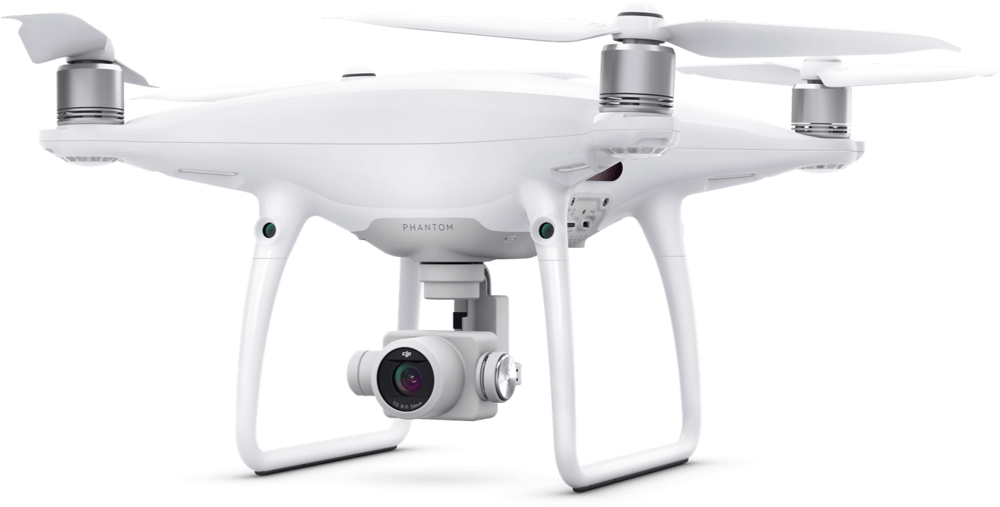
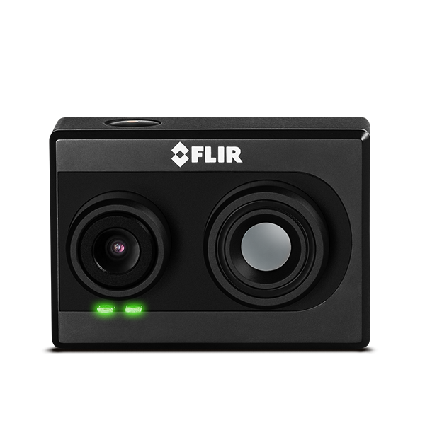
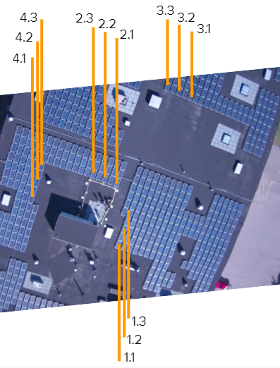
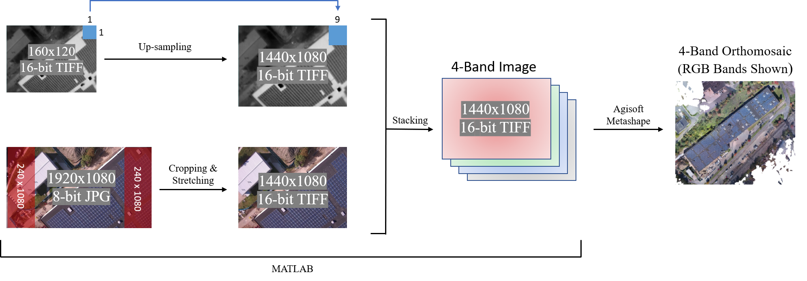
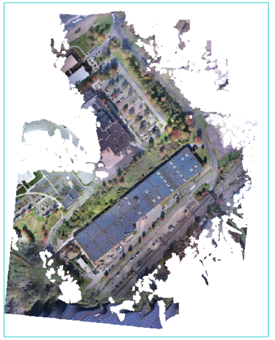
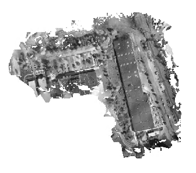
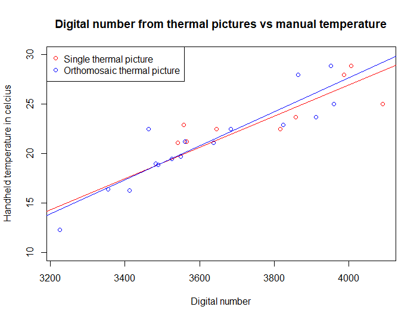
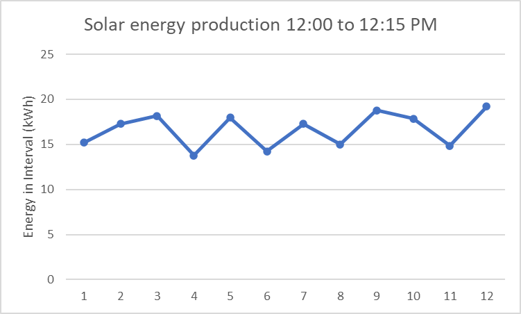
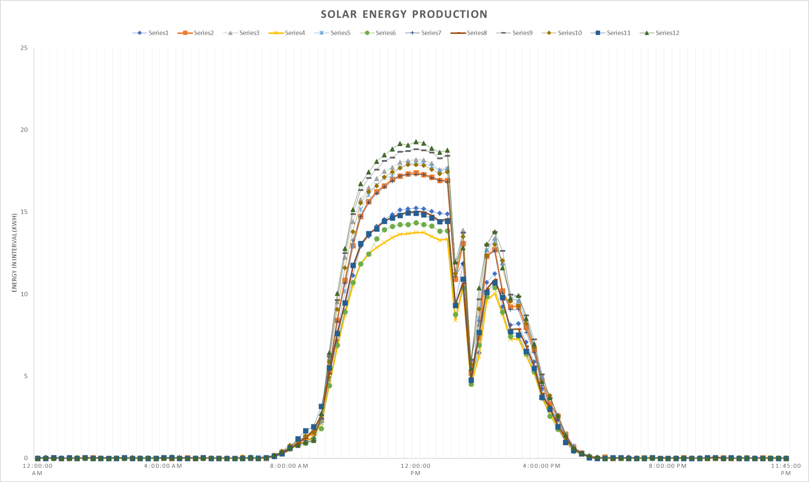

# UAV Photovoltaic Arrays Assessment

## Overview
This cross-collaborative research project assessed the efficiency of photovoltaic (PV) arrays on Yale University’s West Campus using unmanned aerial vehicles (UAVs) and thermal imagery. The study combined drone-based photogrammetry and thermal mosaicking to evaluate solar panel performance, offering insights for energy monitoring and maintenance.

## Flight Mission Details
We conducted UAV flights over Yale’s West Campus PV arrays, using DJI Phantom 4 Pro drones equipped with FLIR DUO R Dual-Sensor cameras. Data was collected at varying altitudes to generate detailed orthomosaics of the PV panels, including both RGB and thermal data.

## Image Acquisition and Processing
Thermal and RGB data were processed using Agisoft Metashape to create orthomosaics. The thermal data was particularly useful for identifying inefficiencies in the solar panels by mapping temperature variations.

## Results
Thermal mosaicking allowed for identification of underperforming panels, contributing to actionable insights for campus maintenance and energy efficiency.

## Figures and Images

### Figure 1: Yale University’s West Campus PV Building

### Figure 2: DJI Phantom 4 Pro Quadcopter

### Figure 3: RGB Camera

### Figure 4: FLIR DUO R Dual-Sensor

### Figure 5: Thermal Hand-Held (Infrared Thermometer)

### Figure 6: Solar Panel Measurement Locations

### Figure 7: Four-band Thermal Mosaicking Workflow

### Figure 8: RGB Orthomosaic

### Figure 9: Thermal Orthomosaic

### Figure 10: Digital Number Values Captured by Thermal Sensor vs Manual Hand-Held Readings

### Figure 11: Solar Energy Readings During Flight (kWh)

### Figure 12: Total Solar Energy Production During Flight (kWh)

