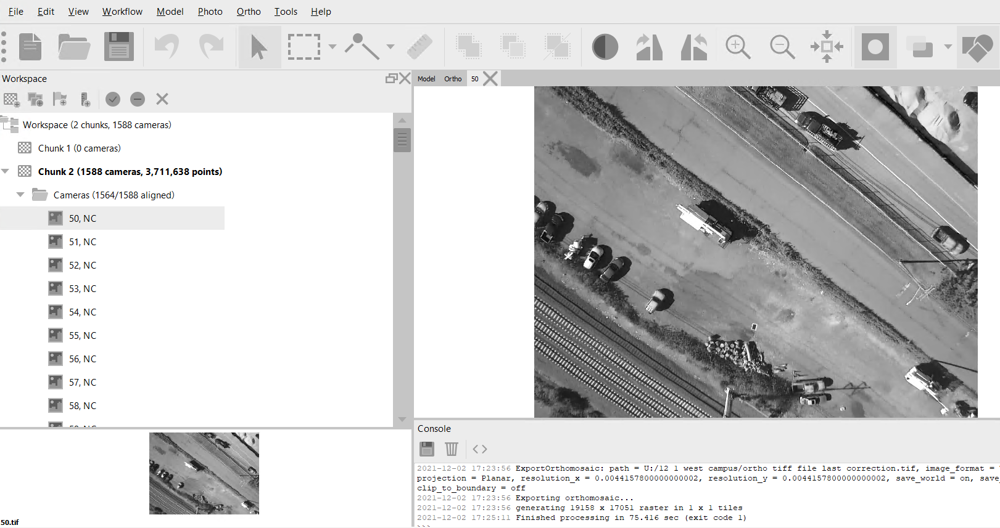

# UAV Photovoltaic Arrays Assessment

ENV 704 								              22 December 2021

____________________________________________________________________________________________________________________________________________________________________________

Toward UAV Decision-Support Tools for Photovoltaic Arrays: a Coastal Connecticut Thermal Mosaicking Case Study

____________________________________________________________________________________________________________________________________________________________________________

	

ZANE H. ANTHONY1, Kevin MATTHEW DUYST2, JEAN VERHEYDEN3, RAYMOND ZHAO4

1Yale University, School of the Environment, 2023 Master of Environmental Management candidate

2Yale University, School of the Environment, 2023 Master of Environmental Science candidate

3Yale University, School of Public Health, 2022 Master of Public Health candidate

4Yale University, Department of Earth & Planetary Sciences, 2022 Bachelor of Science candidate

Summary 

____________________________________________________________________________________________________________________________________________________________________________

A new frontier for drone-based thermal sensors applications is emerging and has expanded markedly in the last two decades. One application with particularly high potential is the energy sector and, more specifically, the solar energy space. The following research considered the utility of unmanned aerial vehicle (UAV) surveys to a medium-scale rooftop photovoltaic (PV) installation. The research mapped a PV array on Yale University’s West Campus in West Haven, Connecticut using a DJI Phantom 4 Pro Quadcopter. A four-band RGB and thermal orthomosaic was generated and compared against ground control points (GCP). Further studies that survey PVs across a systematic gradient of climatic conditions and rooftop arrangements are needed to clarify the decision-support service of drone thermography for PV site installation, design, and upkeep activities in densely urban environments.

Introduction

____________________________________________________________________________________________________________________________________________________________________________

Photogrammetry and the Energy Sector

The energy sector as well as the architecture, engineering and construction sectors stand to benefit tremendously from cutting-edge drone technologies this century. UAVs empower engineers, commercial construction teams, and energy management crews to virtually visit facility sites—more frequently than was otherwise possible—and to collect actionable monitoring data. Oftentimes, these sites are in urban environments where access is fundamentally limited by density, accessibility, privacy concerns, and municipal regulations. Recent research and development of UAVs has proven the material applicability of photogrammetry and thermography in this space, including the inspection of damaged structured following high-energy storm events (Fruchter et al. 2016), aerial-image surveying (Hallermann et al. 2015), three-dimensional survey mapping for job-site earthwork (Siebert and Teizer 2014), and preconstruction geospatial analysis—e.g., slope, terrain data, road width, flooding information—for large-scale construction projects (Parvaresh Karan and Irizarry 2015). A thoughtful integration of drone, photogrammetry, GPS, and digital-surface modeling technologies can address many site-specific needs and resolve decades-long inefficiencies in architecture and construction, from the conceptual design phase all the way through to building completion, structural maintenance, and groundskeeping. 

PV Systems and the Promise of Aerial Thermal Imagery

Concurrent with the rise in photogrammetric applications in sectors pertaining to the built environment, photovoltaic power systems have continued to increase in popularity in the U.S. Whereas solar energy remains an important clean-energy alternative to conventional fossil fuel substitutes, the photovoltaic technologies require significant upkeep and maintenance. Fast, inexpensive, and reliable diagnostic and prognostic tools—and increasingly common, semi-automated services—are a vital asset to field and maintenance teams responsible for the installation and inspection of photovoltaic arrays. 

Thermal sensors on drones are starting to fulfill these needs for solar projects around the world. Mosaicked temperature profiles of installed arrays can quickly localize PV defects such as delaminations (Cubukcu and Akanalci 2019) or excessive mechanical stresses on the individual PV modules. Fine-resolution thermal images can also help field and maintenance crews to pinpoint defects in electrical components with impressive accuracy across the energy supply chain, such as non-operative strings and modules and abnormal heat signatures of fuses, breakers, and interconnection points in a regional power grid. 

As solar systems age over time, best practices for inspection of the highly engineered components of PV modules continue to develop. Further advances in photogrammetry methods for four-band thermal imaging of solar arrays will be of critical importance to help streamline processes and ensure the healthy functioning of decentralized renewable energy generation outfits. Images can also add quantitative rigor to PV array performance ratio and levelized costs of energy, calculations which are decision-supports for survey schedules, module servicing, and PV replacement windows (Fruchter et al. 2016). To help inform this discourse, the research described below attempted a drone-based thermal survey of an array on Yale’s West Campus in West Haven, Connecticut to appraise the utility of four-band thermal mosaics in predicting PV module inefficiencies.

Research Questions 

____________________________________________________________________________________________________________________________________________________________________________

Can thermal sensors accurately predict the efficiency of PVs along Yale’s West Campus?

What implications are associated with combining low resolution data (thermal) with high resolution data (RGB) - i.e., can high resolution RGB imagery compensate for low resolution thermal discrepancies?

What factors can be identified for discrepancies in image processing (climatic conditions, site structuring, etc.)?

Can we compare the percentage of PVs accurately detected in our autonomous flight path with a static map provided by Yale’s West Campus PV layout?

What are future applications of using dual-sensor technologies for automated UAV detection? 

Site description

____________________________________________________________________________________________________________________________________________________________________________

The study area of this research endeavor is contextualized for a broader audience in Figure 1. The UAV-surveyed PV array is nested within four scales: the New England region, the coastal Connecticut scale, the township scale. Yale University’s West Campus straddles two coastal Connecticut townships, Orange and West Haven. The property has belonged to the University since 2007, when it purchased 136 acres of land and research space from Bayer Pharmaceuticals for $109 million. (At the time, former Yale President Richard Levin somewhat flagrantly crowned it “Yale’s Louisiana Purchase.”) 

The campus is home to the sprawling facilities of Yale institutes for nanobiology, microbial sciences, biomolecular design, cancer biology, and the preservation of cultural heritage. In 2015, Yale purchased solar power from Solar City, which has since been acquired by Tesla in 2016, and installed 4,400 solar photovoltaic panels covering close to two acres of rooftop on a storage and receiving facility. The installation now generates 1.6 million kilowatt-hours of electricity annually, which is over 20% of West Campus’s total energy demand. The project delivered an eight-fold increase in the university’s on-site renewable energy generation.

Figure 1. Yale University’s West Campus PV Building. This diagram depicts the study area and PV solar arrays within four scales: the New England region, the coastal Connecticut scale, and the township scale.

Instrumentation 

____________________________________________________________________________________________________________________________________________________________________________

Figure 2. DJI Phantom 4 Pro Quadcopter. The UAV platform used for the flight mission.

Figure 3. RGB Camera. The DJI Phantom UAV has a built-in RGB camera that has the capability to geotag the images that it takes.

Figure 4. FLIR DUO R Dual-Sensor. The RGB and thermal camera used to take photos of our study area at nadir direction in burst mode. It takes paired photos of the ROI in four bands: red, green, blue, and thermal. This camera does not have geolocation.

Figure 5. Thermal Hand-Held (Infrared Thermometer). This device captures measurements in wavelengths 7.5 - 13.5 um. Its emissivity was set to 0.95.

Table 1. DJI Phantom 4 Pro Quadcopter Specifications.

Property

Parameters

Weight

1388 g

Diagonal Size

350 nm

Max Speed

45mph (Sport mode); 36mph (Altitude mode); 31mph (GPS mode)

Max Flight Time

Approx. 30 minutes

Max Service Ceiling Above Sea Level

6000m

Operating Temperature Range

0°C to 40°C

Satellite Positioning Systems

GPS

Hover Accuracy Range (GPS Positioning)

Vertical: +- 0.5m; Horizontal: +- 1.5m

Table 2. FLIR DUO R DUAL Sensor Specifications.

Property

Parameters

Dimensions

41 x 59 x 29.6 mm

Weight

84g

Spectral Band (Thermal)

7.5 - 13.5 um

Thermal Frame Rate

7.5 Hz (NTSC); 8.3 Hz (PAL)

Thermal Imager

Uncooled Vox Microbolometer

Thermal Measurement Accuracy

+/- 5°C

Thermal Sensor Resolution

160 x 120

Visible Camera Resolution

1920 x 1080

Image Acquisition and Processing

____________________________________________________________________________________________________________________________________________________________________________

Flight Mission Details

The flight mission was performed on Wednesday, November 3rd, 2021 around 12:00 PM. The ambient air temperature was about 12°C and the relative humidity was 38%. The sky was clear for the first half of the flight and then there were a few clouds for the latter half of the flight. DJI GS PRO was used to set up the flight path over the West Campus Storage and Receiving Center. The flight height was 60 meters above sea level–30 meter above the building. The entire flight took around 20 minutes. The swaths ran in the SW-NE direction with front and side overlaps of 85% and 75% for RGB photos and 85% and 50% for thermal photos, respectively. There were 3,463 total images—of which 1,733 were RGB photos and 1,730 were thermal photos. 6 calibration squares were placed near the launch site–5 were in the sun and 1 was in the shade. Temperature and GPS measurements were taken at each square. Additionally, temperature and GPS measurements were taken at 12 solar panels (Figure 6).

Figure 6. Solar Panel Measurement Locations. Temperature and GPS measurements were taken at these 12 solar panels. Measurements were taken on the solar cell in the 4th column, 3rd row from top left.

Justification for Four-band Thermal Mosaicking (FTM)

The RGB and thermal images, produced by the FLIR Dual Sensor camera during our flight mission, need to undergo mosaicking for further image analysis processes. This is often done using the structure-from-motion (SfM) technique in a photogrammetry software. The SfM technique uses the scale invariant feature transform (SIFT) algorithm to extract features that are common across photos (Yang & Lee, 2019). Further processing creates a sparse point cloud which aids in the creation of a 3D model and an orthomosaic of the image inputs.

Orthomosaics of UAV images are most often generated using RGB photos; moreover, it is challenging to create orthomosaics from thermal images because they have a low lens resolution—in our study, they were 160x120 and 1920x10980 for the thermal and RGB lenses, respectively. Also, the RGB images span three bands while the thermal images only contain one band which creates a weak contrast in the thermal images. We used a novel method called four-band thermal mosaicking (FTM), developed by Yang & Lee (2019), to overcome these obstacles and produce orthomosaics from the UAV thermal images.

FTM Theoretical Workflow

The FTM theoretical workflow is depicted in Figure 7. In the horizontal direction, the thermal lens has a field of view (FOV) of 57° while the RGB lens has an FOV of 72°. In the vertical direction, both lenses have an FOV of 44°. This translates to the fact that the ratio between the length and width of the RGB images is slightly larger than that of the thermal images: 160/120 versus 1440/1080. The MATLAB algorithm in Yang & Lee (2019) up-samples the coarser thermal image so that the original pixel becomes a 9x9 matrix of smaller pixels, each with the same Digital Number (DN) values. A multiple of 9 for up-sampling is chosen because the vertical resolution of the RGB image is 1080, which is 9 times the vertical resolution of the thermal image at 120. By scaling up relative to the vertical direction, this algorithm keeps the frontal overlap the same. 

The side overlap for the RGB image is reduced by 50% to keep it proportional to the new thermal image dimension: 1440x1080. The RGB image is then converted to a 16-bit TIFF image for consistency. In this process, Yang and Lee (2019) chose a multiplier of 10 to make the range of the stretched DN values similar in magnitude compared to the 16-bit range. Because the RGB and thermal images now have the same dimensions and bit depth, a 4-band band stack is created. The result is a TIFF image with the red, green, blue, and thermal band overlayed respectively.

Figure 7. Four-band Thermal Mosaicking Workflow. This diagram depicts the workflow of creating a 4-band orthomosaic from RGB and thermal images. The thermal image is up-sampled by a multiple of 9. The RGB image is cropped and stretched. Once stacked, the 4-band images are used to create an orthomosaic in Agisoft Metashape. This figure was adapted from Figure 3 in Yang and Lee (2019).

FTM Workflow Application

There were 1,733 RGB photos and 1,730 thermal photos. Each photo name started with the flight date “20211103_” followed by the photo number. Because there were 3 extra RGB images, we had to remove them before performing the FTM workflow. Assuming that RGB and thermal images of the same name were true pairs, we ran Python code to pick out which RGB images did not have a pair. The RGB images removed were 20211103_130231_827, 20211103_130734_368, and 20211103_131236_588.

The FTM workflow was performed based on a modified version of the MATLAB code used in Yang and Lee (2019). We inserted an additional variable in the form of a cell array called ‘listofphoto’. It appended a string ‘rooftop_’ to each image name since MATLAB cannot read files that start with a number. The code for up-sampling the thermal images and cropping and stretching the RGB images were kept the same because our image dimension and bit depth were identical to that in Yang and Lee (2019). After running this algorithm, we had a total of 1,730 4-band images.

Mosaicking 

The processed four-band drone camera photos were then added to Agisoft Metashape Professional Version 1.7.4 build 13028 (64 bit) for processing. After the final screen of cameras, the structure for motion (SfM) algorithm was performed in standard sequence: Align Photos, Build Dense Cloud, and Build Orthomosaic (Figure 8 and 9). The entire workflow was several hours in total. The DN value in the thermal photos is proportional to the infrared radiation captured by the thermal camera. By using Stefan-Boltzmann Law (1), this DN value was converted to temperature.

Image Orthomosaic 

The Unmanned aerial vehicle (UAV) surveyed an area of 39.83 acres using the built-in Parrot RGB camera and the attached FLIR camera. The orthomosaic pixel size for the FLIR was calculated to 3.3 cm based off of the RGB component size.  When comparing the orthomosaic thermal band, the DN value correlated to thermal signature as measured by onsite temperature readings which will be detailed in the radiometric calibration portion.  

    

Figure 8. RGB Orthomosaic. Agisoft Metashape was used to generate this RGB orthomosaic. This specific orthomosaic contains images from three total flights over West Campus’ Storage and Receiving Center and parking lots.

  

Figure 9. Thermal Orthomosaic. Agisoft Metashape was used to generate this thermal orthomosaic. This specific orthomosaic contains images from two total flights over West Campus’ Storage and Receiving Center and the north parking lot.

Radiometric Calibration 

The DN values from the four band orthomosaic were calibrated with temperature measurements from an infrared thermometer performed simultaneously to the image capture.  These measurements were performed at 12:09 PM on November 11, 2021 on 7 45 cm Ground Control Points and 12 solar panels in total (3 readings were performed at 4 separate solar arrays).

Linear regression was calculated between the measured temperatures and the DN values from the singular thermal images captured at time of UAV flight as well as the DN values from the thermal orthomosaic created by AGISOFT.  This regression equation was used to convert the DN from the thermal orthomosaic back to temperature (Figure 10).  This linear regression model was compared to a previously calculated linear regression model with the same FLIR camera however different weather, site conditions, infrared thermometers as well as different photogrammetric processing software.  The linear regression differences in the two models are primarily in the offset component with similar slopes.  

During radiometric calibration, the linear regression for the single thermal images and the orthomosaic images were compared to similar studies using the technique of four band mosaicking (2).  The differences in photogrammetry processing software and infrared thermal devices should be considered when creating the linear model.  However, when examining between the single thermal image to the orthomosaic image, the linear model was consistant within the same data acquisition and processing techniques.  The linear regression model analyzed from single thermal images correlating to our calibration points which were directly from FLIR Camera images is Temperature (C)  = 0.016(DN) - 36.2 with an  R2 = 0.84 and p<0.01.  Whereas the linear regression model composed from Agisoft in orthomosaic form correlating to the calibration points is Temperature (C) = 0.017(DN) - 41.0 with an R2 = 0.81  and p<0.01.

  

Figure 10. Digital Number Values Captured by Thermal Sensor versus Manual Hand-Held Readings. The linear regression model was consistent within the same data acquisition and processing techniques. The r-squared value for the linear regression model that used values from the FLIR camera image is 0.84. The r-squared value for the linear regression model that used values from the orthomosaic is 0.81.

Correlation with Energy Output

Yale’s West Campus solar energy output was provided by the university. Additional information on PV production and solar efficiency was provided by an outside expertise, Tesla. Although there are 20 solar panel groups, the energy production is represented by 12 electrical meters.  Per Tweed airport weather conditions, the sky was clear below 12,000 feet at ground level at 10 am but as the day progressed, the sky had a few clouds at 6,000 feet at ground level when our image acquisition was completed.  Sunrise was at 7:24 AM and sunset was at 5:46 PM for November 11, 2021.  In total the roof of Yale’s West Campus Building had 4,400 photovoltaic panels.  The number of panels ranged from 99 to 456 in the 20 groups.  Energy output over the 15 minute interval at flight mission time ranged from 13.76 to 19.2 kWh for the 12 electrical meters.

The energy output of the 12 solar arrays was quite consistent during the time of our flight mission–it ranged from about 14 kWh to 19 kWh (Figure 11). In Figure 12, the energy production for November 3, 2021 is displayed. At the beginning of our flight (12:00PM), the skies were clear. By the end of our flight (12:15PM), there were several clouds overhead. This correlates well with the drop in energy production seen around this time (Figure 12).

Figure 11. Solar Energy Readings During Flight (kWh). The solar energy production from each of the 12 solar arrays between 12:00 PM and 12:15 PM is displayed.

Figure 12. Total Solar Energy Production During Flight (kWh). The 12 solar arrays and their energy production on November 3rd, 2021 is displayed.

Study Limitations

____________________________________________________________________________________________________________________________________________________________________________

More Orthogonal Flight Path

Geographical terrains have a large influence on UAV image acquisition. PVs are often structured along complex topographies that deter monitoring, making manual inspection of PVs a tedious and time-consuming process. Our study utilized an autonomous flight path generated by the DroneDeploy software. An image of Yale’s West Campus PV distribution (a rooftop perspective) was uploaded into DroneDeploy. We did not alter the algorithm’s recommended flight path; a key element to this study was the autonomous construction of UAV image acquisition. However, a more orthogonal flight path might have allowed for less gaps in UAV image capturing–more overlap between the FLIR thermal camera and the UAV’s built-in RGB camera.

More Flights

It’s implied that more flights equate to better results: the more images captured, the more accurate (i.e., less gaps and lower chance of missing pixels) the terrain of interest is rendered. Our time of image acquisition during the UAV flight happened to experience heavy winds. Moreover, physical limitations (UAV operating time and experienced battery issue) hindered chances of continued flights. When performing UAV-based PV monitoring, ensure proper preparation for the study’s site geometry. Our case study would have experienced better terrain capturing if additional flights were performed.

Climatic Conditions

UAV’s offer a new perspective for data collection, largely due to their ability to capture images without the influence of clouds (unlike traditional remotely sensed images from satellites). However, this low-altitude influence comes at a tradeoff: UAV’s are exposed to the increased influence of climatic conditions (rain, sleet, snow, wind speeds, etc.). Weather conditions have a large influence on image quality. For instance, turbulence caused by increased wind speeds can physically sway the UAV. This influences the automated flight path, forcing the UAV out of its path trajectory and often causes blurred image capturing as the platform loses stability from strong wind exposure. Although predicting weather conditions is arduous, it is recommended to capture data when climatic conditions are clear, with relatively low wind speeds.

FLIR Camera Geolocation

Thermal infrared imaging captures geothermal surface anomalies (in this study’s case, the solar energy stored and re-emitted by PVs). This study used a FLIR DUO R dual-sensor for thermal capturing. This sensor does not have GPS capabilities, so geo-referencing of our UAV imagery relied on the on-board GPS installed on the DJI Phantom 4. In the absence of GPS, Ground Control Points (GCPs) can be used to geo-reference the images captured. GCPs will appear as crisp, bright sightings in the thermal gradient. We used seven reflective boards as control points and arranged them strategically along the rooftop of Yale’s West Campus building with PVs.

Pixel Size Disparity Between RGB and Thermal Images

A multi-sensor (RGB & Thermal) approach is essential for monitoring the intricacies of an urban environment, specifically the efficiency of PVs at storing and re-emitting solar energy. Thermal scanning of the PVs in our study area allowed for measurements of PV efficiency (i.e., quality of solar energy tradeoffs and implications of PV replacement). Combining thermal images with RGB images is performed through a bundle adjustment fusion technique. This technique relies on the quality of images captured by the RGB sensor: the high-resolution, geo-referenced images are crucial for accurate assessment of PV efficiency.

Future directions

____________________________________________________________________________________________________________________________________________________________________________

Semi-Automated or Fully-Automated Thermal Image Analysis

Future studies will want to meaningfully consider how to automate the image analysis of thermal images of PV modules. The development of a topflight, UAV-based thermal imaging platform that offers a field and maintenance report of some kind to solar energy customers is imminent. This tool will be a highly impactful service to the industry. Using a publicly available training set that improves over time, computer-vision platforms will ultimately generate a novel geospatial referencing system for regions of concern in the thermal image mosaic of the PV sets. This data will be a decision-support for mechanics or PV technicians, perhaps over the lifetimes of solar plant installations around the world.

Site Suitability for New PV Systems in Connecticut

 

Connecticut’s wholesale electricity markets are highly complex systems and call for analogously complex administrative structures to coordinate energy production activities with power supply to Connecticut customers. In 2020, according to the U.S. Energy Information Administration, natural gas fueled about half of Connecticut’s electricity net generation, while solar power accounted for about 2% of net generation; however, solar power accounted for slightly more than two-fifths of the state’s renewable electricity generation. Given that Connecticut is the fourth most densely populated state in the nation and the third-smallest in land area, rooftop PV arrays represent a noteworthy economic development opportunity for the state. Future studies could apply the thermal imaging and other photogrammetric methods to localize new, yet-identified sites in the state where PV arrays would be particularly well suited. Rasterized land parcel data could be presented in a spatially explicit, state-governed land parcel database, paired with drone surveys qualifying the solar potential of each parcel. These tools would be a high value-added site suitability diagnostic for private utilities as well as private citizens keen about potential long-term savings from upfront investments in rooftop solar solutions.

References

____________________________________________________________________________________________________________________________________________________________________________

Cardinale-Villalobos, L. et al. 2020. Solar panel failure detection by infrared UAS digital photogrammetry: a case study. International Journal of Renewable Energy Research 10(3). Online.

Cubukcu, M. and A. Akanalci. 2020. Real-time inspection and determination methods of faults on photovoltaic power systems by thermal imaging in Turkey. Renewable Energy 147(1): 1231-1238. Online.

Fruchter, R., S. Herzog, N. Hallermann, and G. Morgenthal. 2016. Drone site data for better decisions in AEC global teamwork. 16th International Conference on Computing in Civil and Building Engineering, Osaka.

Hallermann, N., G. Morgenthal, and V. Rodehorst. 2014. Vision-based deformation monitoring of large scale structures using Unmanned Aerial Systems. Proc. of 37th IABSE Symposium, Engineering for Progress, nature and People, 2852-2859, Madrid.

Hallermann N., G. Morgenthal, and V. Rodehorst. 2015. Unmanned Aerial Systems (UAS) – Survey and monitoring based on high-quality airborne photos. Proc. of IABSE Conference 2015 Structural Engineering Providing Solutions to Global Challenges, 1279-1286, Geneva.

Han, L. et al. 2015. Direct fusion of geostationary meteorological satellite visible and infrared images based on thermal physical properties. Sensors 15: 703-714. Online. 

Henry, C. et al. 2020. Automatic detection system of deteriorated PV modules using drone with thermal camera. Applied Sciences 10(11): 3802. Online.

Kim, D., J. Young, and C. Kim. 2017. Automated fault recognition of photovoltaic modules based on statistical analysis of UAV thermography. Korean Society of Surveying, Geodesy, Photogrammetry, and Cartography 34(6): 179-182. Online.

Parvaresh Karan, E. and J. Irizarry. 2015. Extending BIM interoperability to preconstruction operations using geospatial analyses and semantic web services. Automation in Construction. Online.

Siebert, S. and J. Teizer. 2014. Mobile 3D mapping for surveying earthwork projects using an Unmanned Aerial Vehicle (UAV) system, Automation in Construction Journal 41: 1-14. Online.

Yang, Y. and X. Lee. 2019. Four-band thermal mosaicking: a new method to process infrared thermal imagery of urban landscapes from UAV flights. Remote Sensing 11(11):1365. Online.

Addendum(s): Guidelines For Replication

____________________________________________________________________________________________________________________________________________________________________________

Addendum A: Information for Flight Mission

Contact Information for West Campus Drone Flights (reach out 2-3 weeks in advance):

Kim Heard

Associate Director of Plant Operations

kimberly.heard@yale.edu 

John Campbell

Physical Safety Officer at Environmental Health & Safety

john.campbell@yale.edu

Judy Landry

judy.landry@yale.edu

Contact 72 hours prior to flight to make arrangements

Sarah Jane

Senior Administrative Assistant of the Office of Sustainability

sustainability@yale.edu

Julie Paquette

Director of Energy

julie.paquette@yale.edu

Tom Downing

Senior Engineer

thomas.downing@yale.edu

Mark Bedner

Director of Plant Operations

mark.bednar@yale.edu

JP Mancuso

Office of Facilities Project Manager

johnpaul.mancuso@yale.edu

Instructions from John Campbell:

Information needed:

Time and date: 10/30 and 11/3 weather and people/pedestrians conditions permitting (4 hour block)

Drone Pilot Information: Yichen Yang, (203)891-2130, yichen.yang@yale.edu

UAS Make/Model/Reg. Number: DJI, Phantom 4 Pro, Reg # FA3R4LR3FH

The following conditions must apply:

The pilot in command will be readily identifiable to the public.

The pilot will adhere to FAA Part 107 requirements, including obtaining authorization via an approved LAANC   (Tweed airport airspace - usually on flight planning app and can obtain day of flight).

The pilot or group representative must call Orange PD at (203)891-2130 and West Haven PD at (203)937-3919 about 2 hours prior to each flight.

The pilot or group representative must email Judy Landry (judy.landry@yale.edu) about 72 hours prior to each flight.  If there is a cancellation due to weather, the call must be made 24 hours prior to the flight.  

Addendum B: Pre-processing Steps - RGB and Thermal Image Pairs and FTM Algorithm

Before working with the FTM MATLAB script, make sure that all RGB images are paired with a thermal image. Even if there are an even number of RGB and thermal images, it is recommended to run code to make sure that all images actually pair up and that it’s not just a coincidence that there are an even number of RGB and thermal images.

The Python code should read in the RGB (jpg) and thermal (tiff) image file names. Then create empty lists for the two types of file names and then add in the names of the photos as strings. Use the list() and set() methods in Python to print the variables that do not have pairs. See below for the Python code.

Now that all unpaired images are removed, it’s time to run the FTM MATLAB script. The original script does not contain the ‘listofphoto’ variable. We added our own code in lines 6-9 and 13-15 so that MATLAB can read image files since they start with a number. Line 6 gives the number of photo pairs. Line 7 assigns the ‘rooftop’ variable a string. Line 8 creates the ‘listofphoto’ variable so that it can be integrated through later. Line 13 gives the position of the photo from 1-1730. Line 14 turns the position number into a string. Line 15 provides the ‘listofphoto’ variable at position ‘k’. Because we used the same FLIR DUAL camera as in Yang and Lee (2019), the rest of the script–which up-samples the thermal images, crops and stretches the RGB images, and then stacks the RGB with the thermal images–remains the same.

Addendum C: Agisoft Post-Processing Steps

After the screened thermal images and the RGB images from the FLIR camera were merged using a Matlab program, they were inspected using ENVI software to check to see if the correct thermal image was merged on the RGB image.  If this four band combined image had significant discrepancies, the image was then cycled back to the Matlab step.  

After sample checking the four band images, the folder was then transferred into Pix4D originally then later Agi-Soft.  Pix4D was used initially due to the research paper that was the guide that processed the images to an orthomosaic using this program (Yichen paper).  Since the Pix4D is not licensed on the YSE computers, a comparison will be made but no further details will be addressed in this paper.  

After the transfer, a pop up menu will ask if these images are in one chunk with several cameras or several cameras.  Choose the one chunk option.  When the menu has returned to the one displayed below, toggle the ortho tab generally on the right panel so that the ortho menu bar is displayed.

When viewing the ortho menu bar, the intensity icon is selected.

Within the pop up menu, click on the estimate button so that the images can change image brightness for easy visualization then ok.

Afterwards, click on the appropriate chunk on the left workspace panel to examine the updated intensity images.   

  

Then click on the chunk to activate the drop down menu to reveal the cameras/images.

By double clicking on the individual camera, the associated image will display either in the small box below or on the left panel.

Inspect these images for blurred or out of place images.  This step is also when unwanted cameras/images should be deleted to improve processing time. By right clicking on the camera that should be deleted a menu will display next to it.

If this camera may be used again in this project, recommend “disable cameras.”  For cameras that are certain not to be included in the project for example blurred images, choose “remove cameras”.

Markers can be placed at this time if the camera is not geotagged but this process is cumbersome especially if there are many images with the same marker.

After inspecting all the cameras, choose “align photos” from the “workflow drop” down menu.

Because our pixel size was large and/or the cameras were not geotagged, under align photos the settings were adjusted from the standard settings.  In particular, after trial and error, the “key point limit” and the “tie point limit” were most impactful in the quality of the orthomosaic with the higher number listed being of maximum positive influence.  Typical high end values should be around 10,000 with a 70,000 as a practical limit unless there are significant factors to overcome.  Of note, the higher these values, the longer processing time will occur (hours).

As a tip, optimizing cameras will better space the cameras.  This step can be skipped.  If this step is performed later, the other models will be erased and the steps will need to be repeated.  

If possible, create a dense cloud.   Initially, error messages may occur if not enough points were generated in the previous step or if the bounding box does not encompass all of the points.  If an error message is generated, consider skipping this step and proceed to build mesh or re-examine the cameras again.  

If ‘build dense cloud’ is selected, this pop up menu appears.  The default setting is Medium.  For our project, no much benefit was seen above high.

For the “Build Mesh” step.  This pop up menu appears.  These were our default settings.  When depth maps were chosen for source data, an error message would sometimes appear.

The Build Texture feature was not really used for our situation.  It seems to be more appropriate for 3-D objects but we rarely used it.

The Build Tiled model was rarely used.  If a good orthomosaic could not be generated, the build tiled model process was performed to get a rough idea of the model. ‘Build orthomosaic’ was chosen to stitch the images together.

Notes on this pop up menu include the geographic button is preferred on most internet searches but our photos were not geotagged so this was not an option.  Our default for Parameters Surface was Mesh.  Depending on the quality or pixel size of the original photos and how well the previous steps worked, the region area was used.  

By clicking on Estimate, the dimensions of the region are displayed. Periodically, the boundaries were made larger in the x or y directions.  

 

After this step an orthomosaic will be generated and can be seen after toggling the ortho tab.  If the orthomosaic is not seen, sometimes clicking on the re-center icon on the menu bar will help.

For our project we were analyzing the tiff digital numbers so our orthomosaic was exported to a file on the computer for further processing on ENVI. 

The settings in the pop up menu were changed so that all the DN values would be exported to the new tiff file.  In particular the ‘Write BigTiff file’, ‘Write Tiled Tiff’, ‘Generate Tiff overviews’ and ‘Save alpha channel’ were checked.  The tiff file that is generated is very large and sometimes would require zip to email but no zip needed for the google drive.

Next, processing with ENVI was performed.

## Extracted Images

